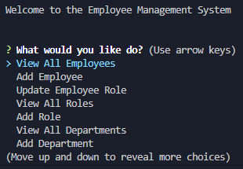

# Employee Mangement System

  

## A onestop solution for managing employees within your company

Utilize the *Employee Management System* tool to manage your employees across all departments as well as job roles and departments themselves to manage your company from a single CLI tool

Table of Contents:
- [Installation](#installation)
- [Usage](#usage)
- [Features](#features)
- [Credits](#credits)
- [Demo](#demo)

## Installation

```
npm i
```

## Usage

```
npm start
```

## Features:
- **Create** and **Update** employees
- **Create** new roles
- **Create** new departments
- View all departments
- View all roles
- View all employees

## Credits:
- Author - [Garrett Lee](https://github.com/RGarrettLee)
- Collaborator - [Dylan Knight](https://github.com/DlonMusk) *(refresher on sql query statement formatting)*

---

## Demo

